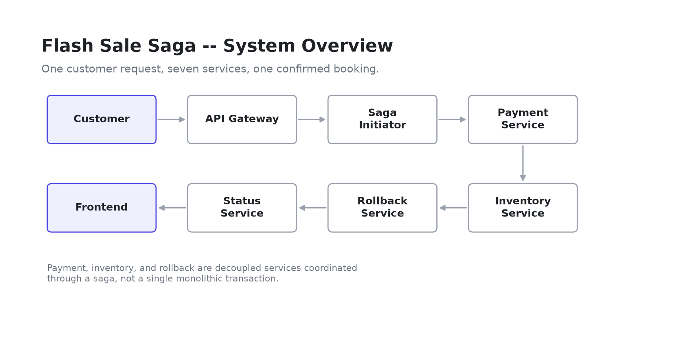
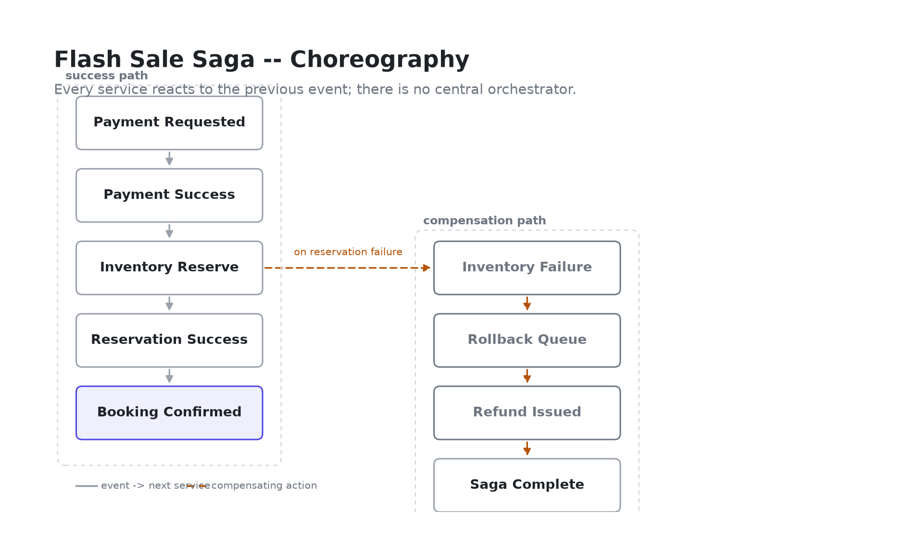
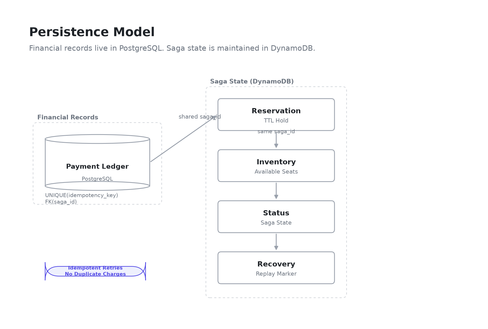
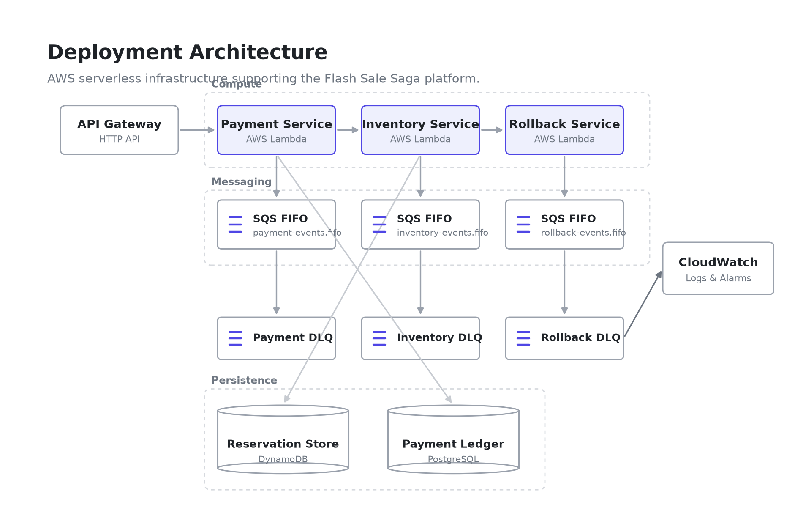
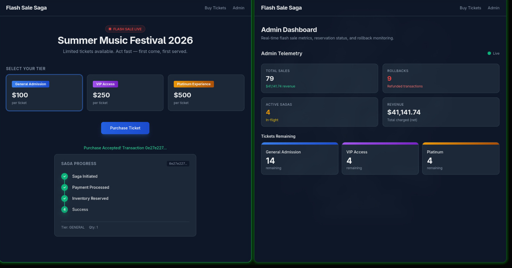

# 🚀 Flash Sale Saga

> **A production-inspired distributed payment platform demonstrating Saga Choreography on AWS.**
>
> Flash Sale Saga is a serverless, event-driven system that simulates high-concurrency ticket purchasing while guaranteeing **exactly-once payment processing**, **idempotent request handling**, **automatic compensation**, and **inventory consistency** without using distributed transactions or two-phase commit.

<p align="center">
    


</p>

---

## ✨ Highlights

- Distributed **Saga Choreography** architecture
- Exactly-once payment processing using **idempotency keys**
- Automatic payment rollback through compensating transactions
- FIFO event ordering with **AWS SQS FIFO**
- Dead Letter Queue (DLQ) recovery pipeline
- Serverless microservices using **AWS Lambda**
- Infrastructure provisioned using **Terraform**
- Interactive **Next.js** dashboard with real-time saga tracking
- 160+ backend tests covering payment, inventory, and orchestration logic

---

## 🏗️ System Architecture

The project is organized into four complementary architecture views.

| View | Description |
|------|-------------|
| **Overview** | High-level microservice architecture |
| **Saga Workflow** | Event flow and compensation logic |
| **Persistence** | PostgreSQL + DynamoDB data model |
| **Deployment** | AWS serverless infrastructure |

---

# 🏛️ Architecture

The system is documented from four complementary perspectives. Each diagram focuses on a single engineering concern, making the architecture easier to understand and maintain.

---

## 1️⃣ System Overview

The high-level architecture showing the interaction between the client application, API Gateway, serverless microservices, messaging layer, databases, and monitoring components.

<p align="center">
    
</p>

---

## 2️⃣ Saga Workflow

The complete event-driven workflow demonstrating payment processing, inventory reservation, compensation, and rollback using the Saga Choreography pattern.

<p align="center">
    
</p>

---

## 3️⃣ Persistence Architecture

The persistence model separates financial consistency from distributed workflow state.

- **PostgreSQL** acts as the financial system of record.
- **DynamoDB** stores reservation state and saga progress.
- A shared **Saga ID** correlates business transactions across both data stores.

<p align="center">
    
</p>

---

## 4️⃣ Deployment Architecture

The deployment view illustrates the AWS serverless infrastructure powering the platform.

It includes API Gateway, Lambda-based microservices, SQS FIFO queues, Dead Letter Queues (DLQs), CloudWatch monitoring, and persistent storage.

<p align="center">
    
</p>

---
# ⚙️ Core Features

### 💳 Exactly-Once Payment Processing

Every purchase request is assigned a unique **idempotency key**, ensuring duplicate submissions never create multiple payment records. The payment ledger remains financially consistent even under retries, client refreshes, or Lambda re-executions.

---

### 🔄 Distributed Saga Choreography

The platform implements **event-driven Saga Choreography** instead of a central orchestrator.

Each service reacts independently to domain events while compensating transactions automatically recover from partial failures.

---

### 📦 Inventory Consistency

Inventory reservations are protected using **DynamoDB conditional writes**, preventing overselling without distributed locks or database transactions.

---

### ⚡ Ordered Event Processing

All business events are published through **AWS SQS FIFO queues**, providing:

- Ordered event delivery
- Exactly-once message processing
- Message deduplication
- Per-transaction isolation

---

### ♻️ Automatic Compensation

If inventory reservation fails after payment succeeds, the system automatically publishes a rollback event that refunds the customer and restores financial consistency.

---

### 🛡️ Fault Tolerance

The platform is designed to recover from production-style failures, including:

- Duplicate purchase attempts
- Lambda crashes
- Poison messages
- Inventory conflicts
- Partial workflow failures
- Lost event recovery

---

### 📊 Observability

CloudWatch metrics, structured logs, DLQs, and monitoring Lambdas provide operational visibility into distributed workflows and simplify debugging.

---
# 📸 Project Demonstration

The following screenshots demonstrate the platform executing real distributed workflows, handling failures, and maintaining financial consistency.

---

## End-to-End Purchase Flow

<p align="center">
    
</p>

**What this demonstrates**

- Successful Saga execution
- Payment authorization
- Inventory reservation
- Real-time status tracking
- Admin dashboard updates

This confirms that the complete purchase workflow executes successfully across all participating microservices.

---

## Distributed Event Processing

<p align="center">
    
</p>

**What this demonstrates**

- Independent worker execution
- FIFO message consumption
- Event-driven communication
- Sequential saga progression

Each worker processes events independently while maintaining strict ordering through SQS FIFO queues.

---

## Duplicate Purchase Protection

<p align="center">
    
</p>

**What this demonstrates**

- Idempotency enforcement
- Duplicate request detection
- Safe request rejection
- Financial consistency

Repeated purchase attempts return **HTTP 409 Conflict**, preventing duplicate charges before payment processing begins.

---

## Inventory Exhaustion & Compensation

<p align="center">
    
</p>

**What this demonstrates**

- Inventory reservation
- Stock exhaustion handling
- Distributed consistency
- Automatic rollback trigger

Inventory is updated using DynamoDB conditional writes, preventing overselling even under concurrent purchase requests.

---

## Graceful Failure Handling

<p align="center">
    
</p>

**What this demonstrates**

- Safe client failure
- No orphaned transactions
- No payment initiated
- Graceful error propagation

If the API becomes unavailable before a payment request is accepted, the workflow terminates safely without creating inconsistent state.

---
# 🤔 Why Saga Choreography?

This project intentionally uses **Saga Choreography** instead of a centralized orchestrator.

### Benefits

- No single point of failure
- Loosely coupled services
- Independent deployment
- Horizontal scalability
- Natural event-driven communication

### Trade-offs

- Higher operational complexity
- Event tracing becomes more challenging
- Additional observability required

This mirrors the trade-offs commonly encountered in modern distributed systems.

---
# 🧪 Testing & Quality

Reliability was a primary design goal. The project includes automated tests covering the complete payment lifecycle, inventory reservation, compensation workflow, and shared libraries.

### Test Coverage

| Component | Tests |
|-----------|------:|
| Shared Library | 97 |
| Payment Service | 16 |
| Inventory Service | 27 |
| Saga Initiator | 20 |
| **Total** | **160+** |

### Quality Assurance

- ✅ Unit Tests (Pytest)
- ✅ Integration Tests
- ✅ Idempotency Validation
- ✅ Compensation Workflow Testing
- ✅ Distributed Saga Simulation
- ✅ Load Testing with Locust

Run all tests:

```bash
pytest
```

Generate coverage:

```bash
pytest --cov=. --cov-report=term-missing
```

---

# 📂 Repository Structure

```text
flash-sale-saga/
│
├── frontend/              # Next.js dashboard
├── payment/               # Payment microservice
├── inventory/             # Inventory microservice
├── saga_initiator/        # FastAPI entrypoint
├── shared/                # Shared domain library
├── infrastructure/        # Terraform modules
├── scripts/               # LocalStack & utilities
├── docs/
│   ├── overview.png
│   ├── workflow.png
│   ├── storage.png
│   ├── deployment.png
│   ├── RUNBOOK.md
│   └── SYSTEM_DESIGN_DOCUMENT.md
│
└── README.md
```

---

# 📚 Documentation

Additional project documentation is available in the **docs** directory.

| Document | Description |
|----------|-------------|
| 📘 SYSTEM_DESIGN_DOCUMENT.md | Complete architecture and design decisions |
| 📖 RUNBOOK.md | Operational procedures and recovery steps |
| 🏛️ overview.png | High-level system architecture |
| 🔄 workflow.png | Saga execution workflow |
| 💾 storage.png | Persistence architecture |
| ☁️ deployment.png | AWS deployment topology |

---

# 🚀 Quick Start

<details>

<summary><strong>Run the project locally</strong></summary>

### Clone

```bash
git clone https://github.com/<your-username>/flash-sale-saga.git
cd flash-sale-saga
```

### Backend

```bash
python -m venv .venv

source .venv/bin/activate
# Windows
# .venv\Scripts\activate

pip install -e ./shared
pip install -e ./payment
pip install -e ./inventory
pip install -e ./saga_initiator
```

### Infrastructure

```bash
docker compose up -d

bash scripts/localstack-init.sh

bash scripts/seed-dynamodb.sh

bash scripts/seed-postgres.sh
```

### Start API

```bash
uvicorn saga_initiator.main:app \
    --reload \
    --port 8000
```

### Workers

```bash
python scripts/run_workers.py
```

### Frontend

```bash
cd frontend

npm install

npm run dev
```

Open

```
http://localhost:3000
```

</details>

---

# ☁️ Infrastructure

Infrastructure is fully provisioned using **Terraform**.

Provisioned AWS resources include:

- API Gateway
- AWS Lambda
- SQS FIFO Queues
- Dead Letter Queues
- DynamoDB
- CloudWatch
- IAM
- SNS

Deploy infrastructure:

```bash
cd infrastructure

terraform init

terraform plan

terraform apply
```

---

# 📈 Future Improvements

Potential production enhancements include:

- EventBridge integration
- Multi-region deployment
- Distributed tracing using AWS X-Ray
- OpenTelemetry metrics
- Kubernetes deployment option
- Multi-payment provider support
- Event sourcing
- CQRS read models

---

# 💡 Lessons Learned

Building this project required solving several distributed systems challenges:

- Designing idempotent APIs
- Coordinating distributed transactions
- Implementing compensating actions
- Handling eventual consistency
- Recovering from partial failures
- Maintaining financial correctness
- Building observable event-driven systems

---

# 🙌 Acknowledgements

This project was built to explore production-inspired distributed system design using AWS serverless technologies and the Saga Choreography pattern.

Although simplified for learning purposes, the architecture follows many principles used in real-world payment platforms.

---

# 📄 License

This project is released under the MIT License.
"" 
